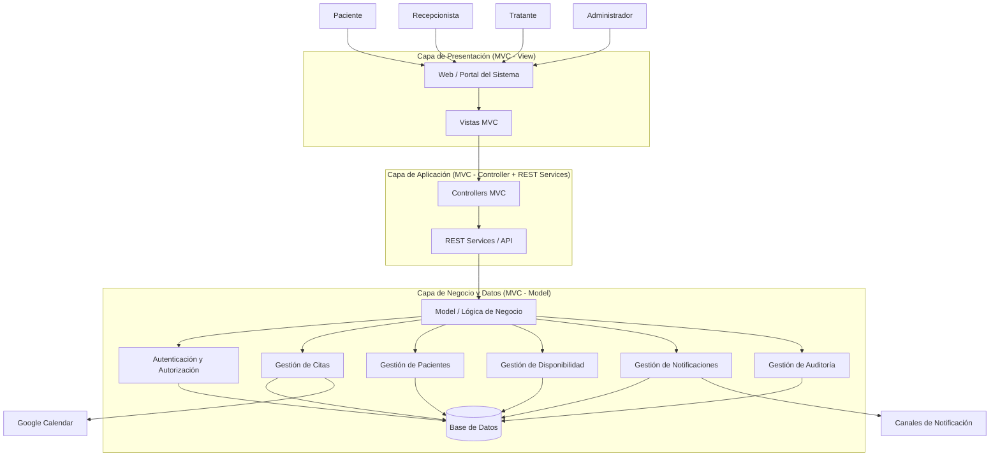

# Sistema de Gestión de Citas y Agendamiento de Pacientes - Actividad de Diseño

## 1.- Identificación de Requerimientos No Funcionales (NFR Non Functional Requirements)

**Actividad:** Identifica y enumera los requerimientos no funcionales y explica brevemente cómo afectan a tu sistema. Puedes utilizar los apuntes del
curso para obtener ejemplos de requerimientos no funcionales comunes.

**NOTA** Un requerimiento no funcional es una especificación que describe las propiedades, restricciones o atributos de calidad que debe cumplir un sistema, definiendo cómo debe comportarse en lugar de qué funcionalidades debe ofrecer.

Características clave
    -   No describen funcionalidades específicas, sino condiciones de operación.
    -   Aplican de forma transversal a múltiples o todos los casos de uso.
    -   Son medibles o verificables (idealmente).
    -   Impactan directamente en el diseño arquitectónico.

Ejemplos de atributos de calidad
    -   Seguridad
    -   Rendimiento
    -   Disponibilidad
    -   Usabilidad
    -   Escalabilidad
    -   Mantenibilidad Interoperabilidad
  

Diferencia con requerimientos funcionales
    -   Funcional: qué hace el sistema (ej. agendar una cita).
    -   No funcional: cómo debe hacerlo (ej. en menos de 100 ms, con autenticación, disponible 99,5%).

## 1.1 RNF1: Autenticación y autorización

**Descripción:**
El sistema debe proveer mecanismos de autenticación y autorización.

**Impacto en el sistema:**
Este requerimiento permite identificar a los usuarios y controlar el acceso a las funcionalidades según su rol (paciente, recepcionista, tratante, administrador). Es fundamental para proteger la información sensible y asegurar que cada usuario solo acceda a lo que le corresponde.

**Implicancias en el diseño:**
- Implementación de mecanismos de login.
- Gestión de roles y permisos.
- Validación de acceso en cada operación relevante del sistema.

---

## 1.2 RNF2: Auditoría de accesos y modificaciones

**Descripción:**
El sistema debe registrar auditoría de accesos y modificaciones.

**Impacto en el sistema:**
Permite mantener trazabilidad de todas las acciones realizadas por los usuarios, lo que facilita la detección de errores, control de cambios y revisión de actividades dentro del sistema.

**Implicancias en el diseño:**
- Registro de eventos relevantes (quién, cuándo, qué acción).
- Persistencia de logs de auditoría.
- Posible desacoplamiento del sistema de auditoría para no afectar el rendimiento.

---

## 1.3 RNF3: Disponibilidad

**Descripción:**
La plataforma debe estar disponible para los usuarios más del 99,5% del tiempo en horario laboral.

**Impacto en el sistema:**
Este requerimiento asegura la continuidad operativa del sistema, evitando interrupciones en procesos críticos como el agendamiento y confirmación de citas.

**Implicancias en el diseño:**
- Infraestructura confiable.
- Monitoreo del sistema.
- Estrategias de recuperación ante fallos.
- https://www.dotcom-monitor.com/es/calculadora-de-disponibilidad/

---

## 1.4 RNF4: Rendimiento

**Descripción:**
El sistema debe responder en menos de 100 ms para operaciones estándar.

**Impacto en el sistema:**
Influye directamente en la experiencia de usuario, permitiendo una interacción rápida y fluida, especialmente en procesos de alta frecuencia como consultas de agenda y agendamiento.

**Implicancias en el diseño:**
- Optimización de consultas a base de datos.
- Uso de índices y posibles mecanismos de caché.
- Diseño eficiente de APIs.
- https://bytebytego.com/guides/what-are-the-top-caching-strategies/

---

## 1.5 RNF5: Usabilidad en transacciones largas

**Descripción:**
Para transacciones largas, el sistema debe desplegar mecanismos de información al usuario (por ejemplo, barra de progreso).

**Impacto en el sistema:**
Mejora la experiencia del usuario al reducir la incertidumbre durante operaciones que requieren más tiempo de procesamiento.

**Implicancias en el diseño:**
- Implementación de indicadores de carga.
- Manejo de estados de espera en la interfaz de usuario.

---

## 1.6 RNF6: Manejo de errores

**Descripción:**
Cuando se supere el tiempo máximo de respuesta, el sistema debe desplegar un mensaje de error claro al usuario.

**Impacto en el sistema:**
Permite al usuario comprender situaciones de falla y evita comportamientos incorrectos como repetir acciones innecesariamente.

**Implicancias en el diseño:**
- Definición de timeouts.
- Manejo centralizado de errores.
- Diseño de mensajes comprensibles y no técnicos.

---

## 1.7 RNF7: Restricción de usabilidad (agendamiento)

**Descripción:**
El paciente debe realizar como máximo 3 clics para agendar una cita.

**Impacto en el sistema:**
Este requerimiento impone una restricción directa sobre el diseño de la interfaz, buscando simplificar el proceso de agendamiento y mejorar la experiencia del usuario.

**Implicancias en el diseño:**
- Reducción de pasos en el flujo de agendamiento.
- Interfaces simples y directas.
- Priorización del flujo principal del sistema.

## 2.- Selección de estilo de Arquitectura

**Actividad**: en base a los requerimientos no funcionales y a los requerimientos
funcionales, descritos mediante los casos de uso, selecciona al menos un
estilo arquitectónico adecuado para resolver ambos tipos de
requerimientos (funcionales y no funcionales) indicando lo siguiente:
1. Justificación para seleccionar el o los estilos arquitectónicos en
base a los requerimientos funcionales y no funcionales.
2. Ventajas y desventajas de la estrategia seleccionada en el
contexto de tu sistema.
3. Realiza un diagrama de arquitectura de alto nivel que represente
el sistema en su conjunto, de forma consistente con los
requerimientos funcionales y los casos de uso, y que refleje el
estilo arquitectónico seleccionado. El formato puede ser similar al
ejemplo explicado en la cápsula de Arquitectura de Software, que
utiliza la herramienta online Excalidraw y contiene las
instrucciones de uso en el propio contenido de dicho taller.

## 2.1 Selección de estilo de arquitectura

Primero vamos a evaluar los tradeoff en donde por defecto apuntaremos a un estilo de arquitectura por capas pero contrastaremos con Microservicios.

### 1. ¿El sistema tiene un dominio acotado y bien delimitado?

- **Sí -> evaluar arquitectura por capas, avanzar a siguiente punto.**
- No -> evaluar microservicios

Explicación: En este caso, el sistema está enfocado principalmente en la gestión de citas y agendamiento de pacientes para un centro de salud. Aunque existen actores distintos y algunas integraciones externas, el problema central sigue siendo específico y relativamente acotado. Cuando el dominio está bien delimitado, suele ser más conveniente una arquitectura en capas, ya que permite organizar el sistema sin introducir la complejidad de una distribución temprana en múltiples servicios.

### 2. ¿El núcleo del sistema está centrado en operaciones transaccionales fuertemente relacionadas?

Ejemplos desde Funcionalidades levantadas durante el análisis:
    
    - agendar hora, confirmar cita, reprogramar cita, registrar paciente, configurar disponibilidad, validar reglas de agenda

- **Sí -> pasar a 3**
- No -> evaluar microservicios

Explicación: Los principales casos de uso del sistema están estrechamente conectados entre sí: agendar hora, confirmar cita, reprogramar, registrar pacientes, gestionar disponibilidad y visualizar agenda. Estas funciones comparten datos, reglas y validaciones comunes, lo que indica una alta cohesión funcional. Cuando las operaciones del núcleo están tan relacionadas, una arquitectura en capas resulta más natural, porque permite centralizar y coordinar mejor la lógica del negocio.

### 3. ¿Las reglas de negocio requieren consistencia fuerte e inmediata?

Ejemplos desde Requerimientos y Restricciones:
    
    - una cita solo puede estar en un estado a la vez  
    - un tratante no puede tener dos pacientes al mismo tiempo  
    - un paciente no puede registrarse dos veces  

- **Sí -> favorecer arquitectura en capas**
- No -> pasar a 4 

Explicación: 
El sistema posee reglas de negocio estrictas, por ejemplo, evitar dobles reservas, impedir estados contradictorios en una cita y controlar registros duplicados de pacientes. Estas reglas requieren que ciertas validaciones se resuelvan de manera inmediata y consistente en la misma operación. Cuando la consistencia fuerte es un requisito importante, la arquitectura en capas suele ser más adecuada que microservicios, porque evita la complejidad adicional de coordinar múltiples servicios distribuidos y manejar consistencia eventual. Para Microservicios, si buscamos garantizar consistencia transaccional, debemos pensar en incorporar patrones como SAGA: https://medium.com/javarevisited/difference-between-saga-and-cqrs-design-patterns-in-microservices-acd1729a6b02

### 4. ¿El sistema necesita escalar de manera muy diferente por módulos independientes?

Ejemplos:
        
    - notificaciones con carga masiva  
    - reportes pesados  
    - múltiples integraciones externas  
    - subdominios con crecimiento desigual  

- Sí -> evaluar microservicios
- **No -> pasar a 5**

Explicación: Los microservicios tienen más sentido cuando distintas partes del sistema presentan necesidades de escalamiento muy diferentes. Por ejemplo, un módulo de notificaciones masivas podría requerir mucho más procesamiento que el módulo de administración de usuarios. En el caso actual, aunque existen componentes que podrían crecer, el documento no muestra aún una necesidad clara de escalamiento independiente por subdominios. Por eso, mientras esa necesidad no sea evidente, la arquitectura en capas sigue siendo una alternativa más simple y razonable.

### 5. ¿Existen múltiples equipos de desarrollo que requieran despliegue autónomo?

- Sí -> evaluar microservicios  
- **No -> favorecer arquitectura en capas**

Explicación: Uno de los grandes beneficios de los microservicios aparece cuando distintos equipos trabajan en módulos separados y necesitan desarrollar, desplegar y evolucionar esos módulos de manera independiente. Sin embargo, en este problema no se evidencia una organización de desarrollo de esa magnitud. Si el sistema será implementado por un solo equipo o por un grupo pequeño, dividirlo desde el inicio en muchos servicios puede aumentar innecesariamente la complejidad técnica y operativa. En ese contexto, la arquitectura en capas favorece un desarrollo más controlado y mantenible.

### 6. ¿La operación distribuida está justificada por el tamaño y complejidad real del problema?

Esto implica asumir:
    
    - comunicación entre servicios  
    - observabilidad distribuida  
    - tolerancia a fallos de red  
    - coordinación por eventos  
    - mayor complejidad de despliegue  

- Sí -> microservicios pueden justificarse  
- **No -> arquitectura en capas es la mejor decisión inicial**

Explicación: Adoptar microservicios no solo significa dividir el sistema, sino también asumir costos técnicos adicionales: comunicación por red, monitoreo distribuido, manejo de fallos parciales, trazabilidad entre servicios, versionado de contratos y despliegue más complejo. Para que esta decisión sea razonable, el tamaño y complejidad del problema deben justificar claramente ese costo. En este sistema, el alcance actual todavía parece más cercano a una solución cohesiva de complejidad media que a una plataforma distribuida de gran escala, por lo que la arquitectura en capas resulta más proporcionada.

**Decisión Final:**

Dado que el sistema se centra en el agendamiento, posee un dominio acotado, presenta reglas de negocio con alta necesidad de consistencia, y no muestra todavía señales claras de requerir escalamiento o despliegue independiente por múltiples equipos, la alternativa más adecuada es una **arquitectura en capas**. Esta opción permite modelar de forma clara la lógica del sistema, mantener control sobre las reglas de negocio y responder adecuadamente a los requerimientos funcionales y no funcionales del problema.

## 2.2 Diagrama de Arquitectura

